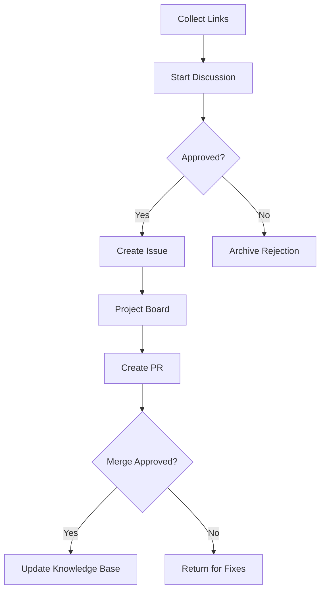

# Knowledge Vault Guardian

 

A collaborative knowledge curation system for technical content validation and preservation over time.

## 📖 Table of Contents
- [Workflow Overview](#-workflow-overview)
- [Getting Started](#-getting-started)
- [Content Submission Process](#-content-submission-process)
- [Repository Structure](#-repository-structure)
- [Contributing](#-contributing)

## Workflow Overview

