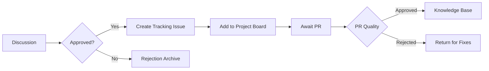

## Content Submission Process

### 1. Discussion Phase

**Discussion Title Format:**  
`[Review][Tech Domain] - Descriptive Title`  
*Example:*  
`[Review][.NET C#] - Advanced LINQ Optimization Techniques`

## Content Metadata
| Field | Requirement | Example |
|-------|-------------|---------|
| **Original URL** | Full working link | `https://example.com/article` |
| **Content Language** | ISO 639-1 Code | `PT`, `ES`, `EN` |
| **Content Type** | Category | `Article`, `Video`, `Research Paper`, `Tool` |
| **Time Investment** | MM mins/HH hours | `25 mins`, `1.5 hours` |

## Quality Checklist
- [ ] No paywall/payment required
- [ ] Technical accuracy confirmed (*Whether you has tested what the article said*)
- [ ] English title/description available

## Issue and Pull Request Templates
Follow the link of [Issue](/docs/Issue%20template.md) and [Pull Request Submission Standards](/docs/PR%20Submission%20Standards.md) template

## Rejection Flow
Common Rejection Reasons:

|Reason|Example|Prevention|Tip|
|------|-------|----------|---|
|**Duplicate Content**|Existing entry for same topic|Search before submitting|
|**Link Rot**|Broken/Redirected URL	|Use archive.org mirror|
|**Commercial Content	Requires email signup**|Verify open access|
|**Outdated Methods**|Uses deprecated APIs|Check publication date|

## Batch Processing Tips
**Recommended Workflow:**
1. Collect links privately (1-2 weeks)
2. Create batch discussion every Monday
3. Bulk issue creation (up to 5 items/thread)
4. Weekly PR with multiple submissions

**Automation Helpers:**
- `/batch-start` - Initiate group discussion
- `/bulk-add` - Create multiple issues

Whether you are confused by any of the concepts presented, feel free to open an issue and ask.