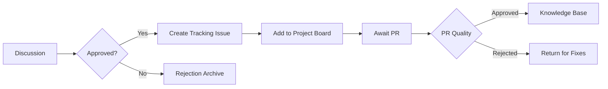

## 📥 Content Submission Process

### 1. Discussion Phase 💬

**Discussion Title Format:**  
`[Review][Tech Domain] - Descriptive Title`  
*Example:*  
`[Review][.NET C#] - Advanced LINQ Optimization Techniques`

## Content Metadata
| Field | Requirement | Example |
|-------|-------------|---------|
| **Original URL** | Full working link | `https://example.com/article` |
| **Content Language** | ISO 639-1 Code | `PT`, `ES`, `EN` |
| **Content Type** | Category | `Article`, `Video`, `Research Paper`, `Tool` |
| **Time Investment** | MM mins/HH hours | `25 mins`, `1.5 hours` |

## Quality Checklist
- [ ] No paywall/payment required
- [ ] Technical accuracy confirmed (*Whether you has tested what the article said*)
- [ ] English title/description available

