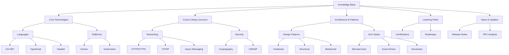

# Project Structure



## Detailed Folder Structure

```bash
/knowledge-base
│
├── core-technologies/
│   ├── languages/
│   │   ├── csharp/
│   │   │   ├── frameworks/
│   │   │   │   ├── aspnet-core.md
│   │   │   │   └── entity-framework.md
│   │   │   ├── performance/
│   │   │   ├── memory-management.md
│   │   │   └── language-features.md
│   │   │
│   │   ├── haskell/
│   │   │   ├── functional-patterns.md
│   │   │   └── concurrency.md
│   │   │
│   │   └── typescript/
│   │       ├── type-system.md
│   │       └── framework-integrations.md
│   │
│   └── platforms/
│       ├── docker/
│       │   ├── compose.md
│       │   └── security.md
│       │
│       └── kubernetes/
│           ├── networking.md
│           └── operators.md
│
├── architecture-patterns/
│   ├── design-patterns/
│   │   ├── creational/
│   │   │   └── factory-patterns.md
│   │   ├── structural/
│   │   └── behavioral/
│   │
│   └── architecture-styles/
│       ├── microservices/
│       │   ├── decomposition.md
│       │   └── interservice-comm.md
│       │
│       └── event-driven/
│           ├── event-sourcing.md
│           └── cqrs.md
│
├── infra-networking/
│   ├── protocols/
│   │   ├── http-versions.md
│   │   └── tcp-ip-stack.md
│   │
│   └── messaging-systems/
│       ├── rabbitmq/
│       └── kafka/
│
├── learning-resources/
│   ├── certifications/
│   │   ├── az-204.md
│   │   └── cka.md
│   │
│   └── roadmaps/
│       ├── backend-2024.md
│       └── devops.md
│
├── news-updates/
│   ├── dotnet-releases.md
│   └── kubernetes-changelogs.md
│
└── _global/
    ├── glossary.md
    ├── cross-references.md
    └── ARCHIVE.md
```

## Categorization System

### Technology Matrix

| Dimension        | Tags Example                          |
|------------------|---------------------------------------|
| **Stack Layer**      | #Frontend, #Backend, #Infrastructure  |
| **Complexity Level** | #101, #201, #301, #401                |
| **Content Type**     | #Tutorial, #DeepDive, #CheatSheet     |

### File Naming Convention
[Technology]_[Topic]_[Version].md

Example:  
- csharp_linq-optimization_net8.md  
- kubernetes_network-policies_v1.28.md
